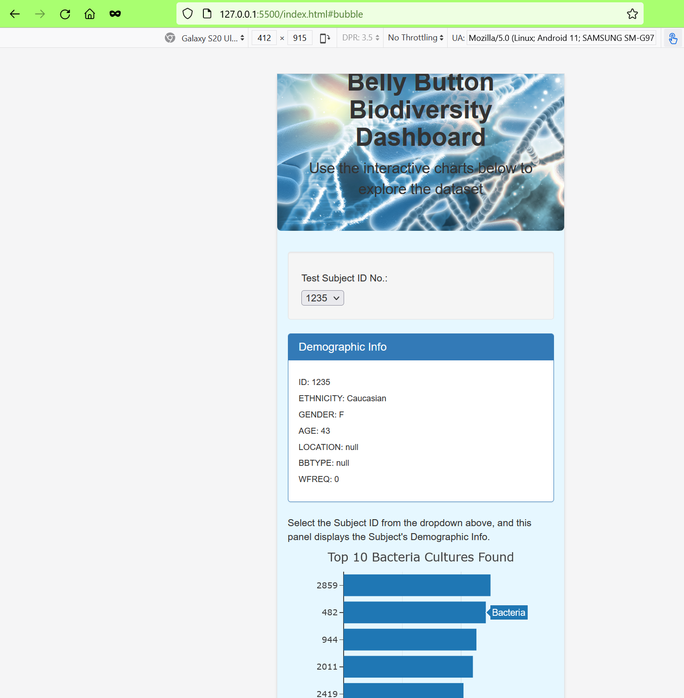

# BBBd - Belly Button Biodiversity Dashboard

## Overview
A research study has collected bacteria samples from the belly buttons of a variety of volunteer subjects.  It is believed that one or more strains of this bacteria may become an ingredient in a novel food.

This project developed a website that allows the user to interactively explore data about the bacteria discovered within the belly buttons of volunteers.

## Technology
This project included the following technologies:
* HTML - information display via the internet
* Bootstrap & CSS - components and styling for the website
* Javascript - programming language for reading and processing JSON data
* Plotly - data visualization and graphing library driven by Javascript

## Features
The website reads and processes JSON data into the Demographics panel and three interactive charts.

### Navigation
The website has a concise navigation bar which allows the user to quickly jump to a desire chart.

### Charts
The Bar and Bubble charts have Hovertext enabled, which allows the user to view the specific bacterial cultures that are depicted by the chart element.

The Bar and Bubble Charts allow the user to click-drag to select an area of interest.  The chart responds by zooming into that area.

The Bubble Chart also has Scroll-Zoom enabled, which allows the user to use a mouse wheel or mobile gestures to zoom into an area of interest.

### Mobile Responsive Design
The website design employs strategies to ensure the site is functional and enjoyable when experienced on a mobile device.

The site was tested using a variety of devices in portrait and landscape orientation.

